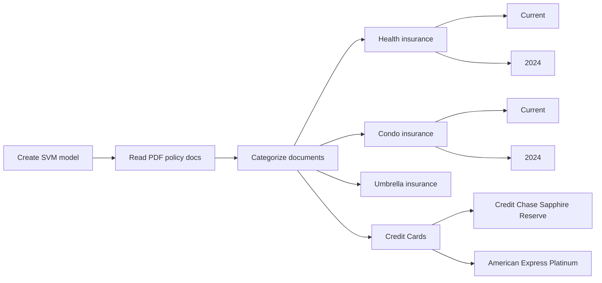

# Home

# Purpose

The purpose of this project is to automatically organize and file a variety of insurance and benefit plan documents into structured folders on a computer using AI. The program should analyze documents, categorize them based on type, and file them into an appropriate folder for the document type and year.

